## Politico - User Interface

### Description
Politico enables citizens give their mandate to politicians running for different government offices 
while building trust in the process through transparency.

### User Interface
[Hosted User Interface](https://the22mastermind.github.io/politico-ui/)

### Technologies Used
* HTML
* CSS
* jQuery

### Screenshots
1. Home page
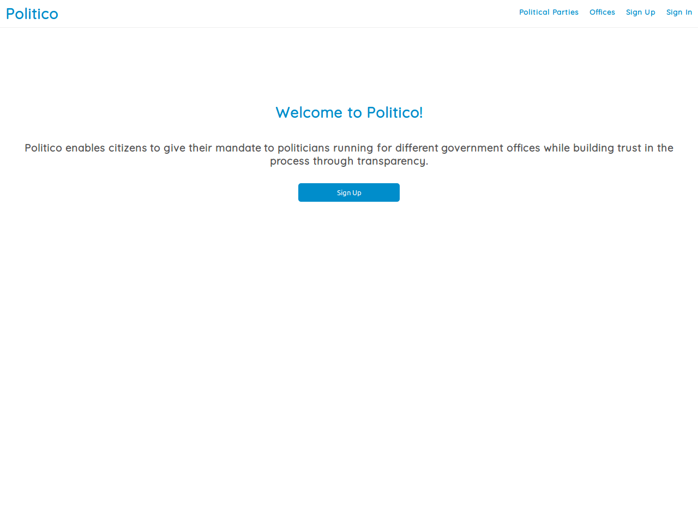

2. Signup page

3. Signin page
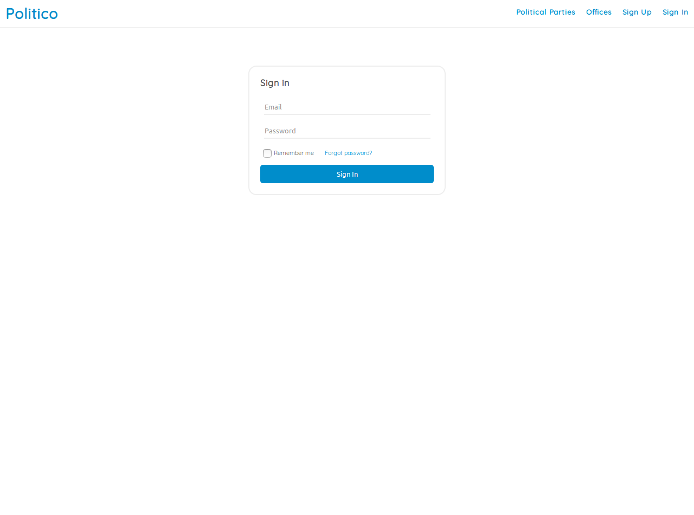

4. Password reset page
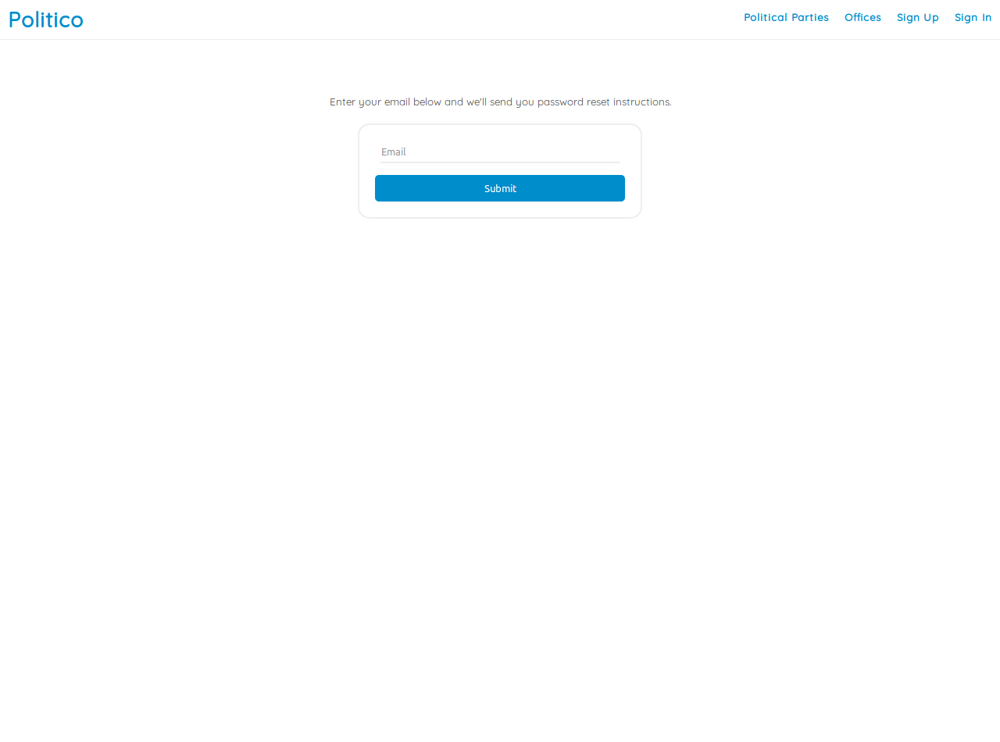

5. Admin create political party
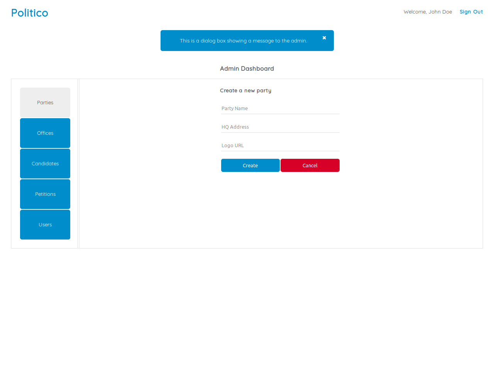

6. Admin edit or delete political party
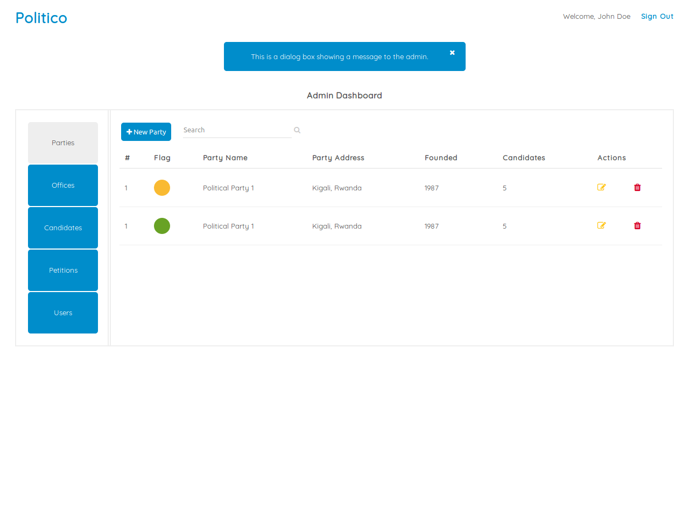

7. Admin create political office
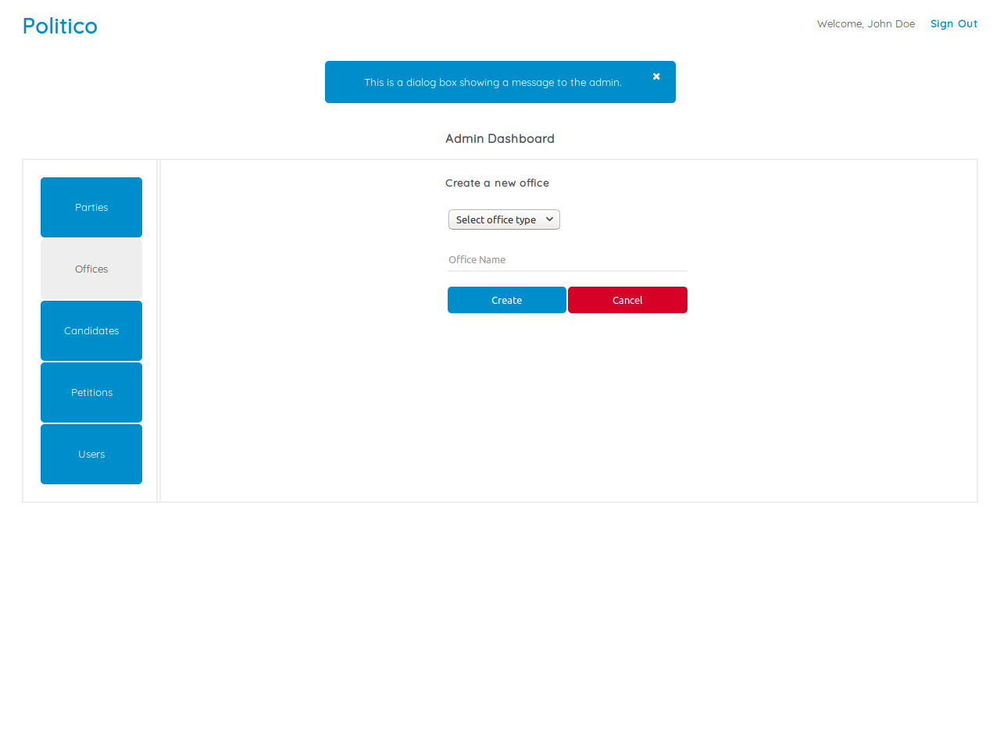

8. Politician express interest to run for an office
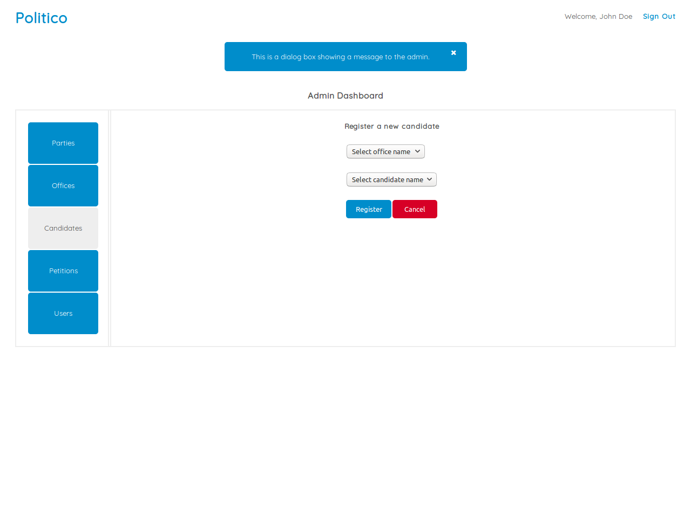

9. User view all political parties page
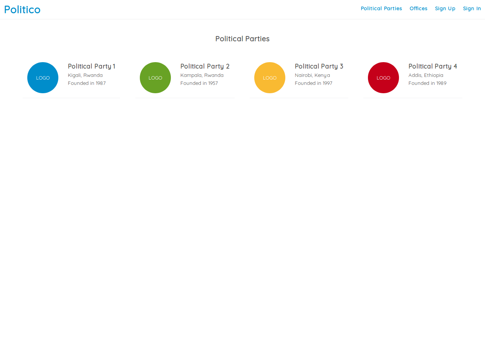

10. User view all political offices page
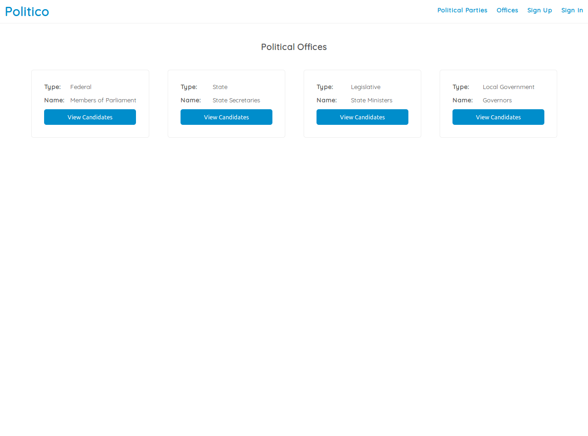

11. User view politicians running for a specific office page
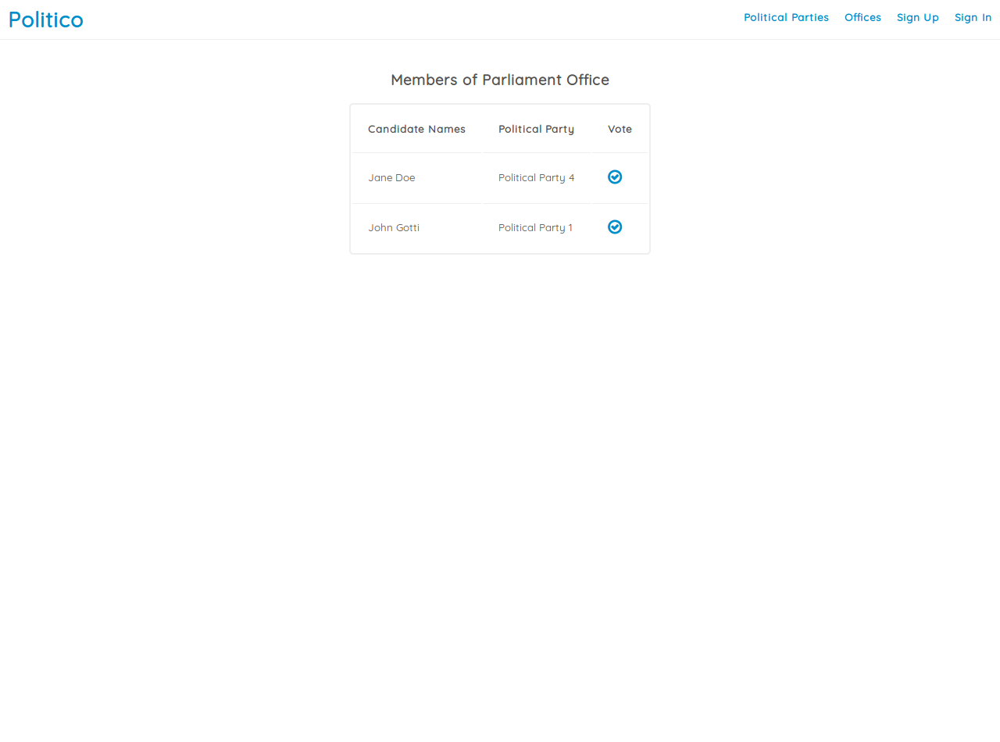

12. User profile page
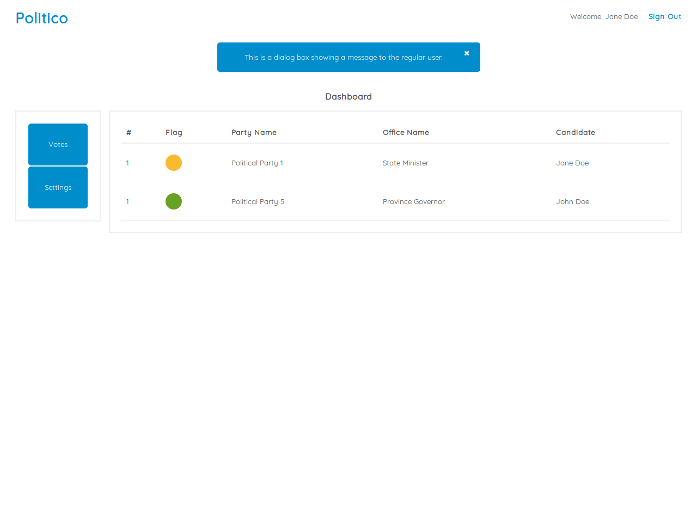